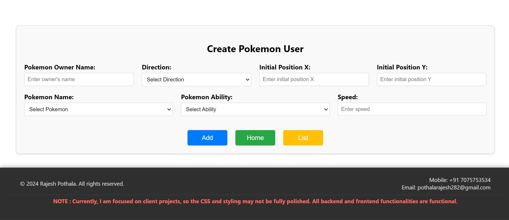
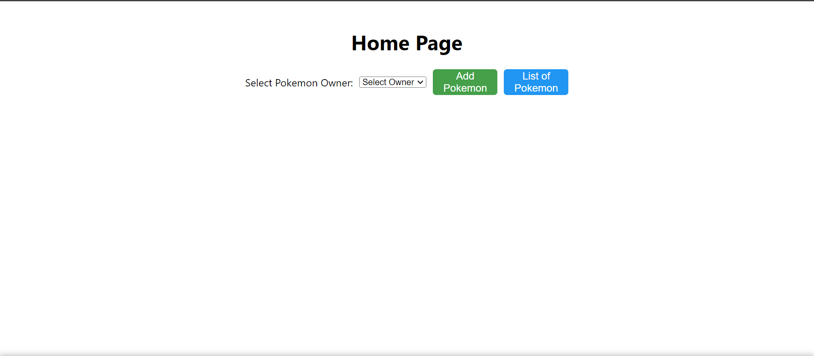
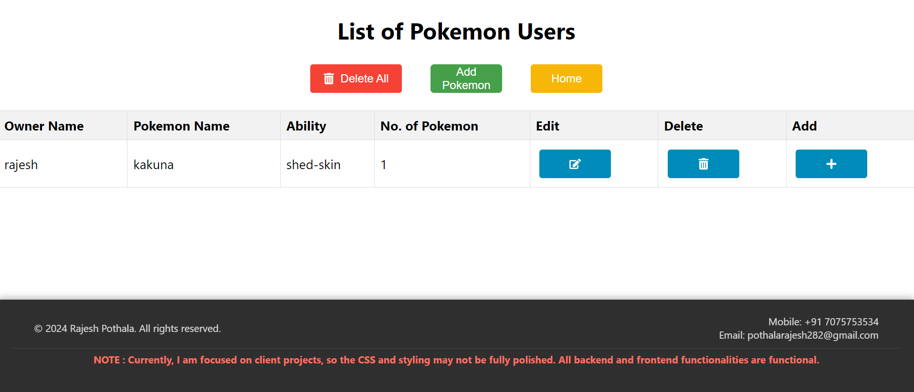
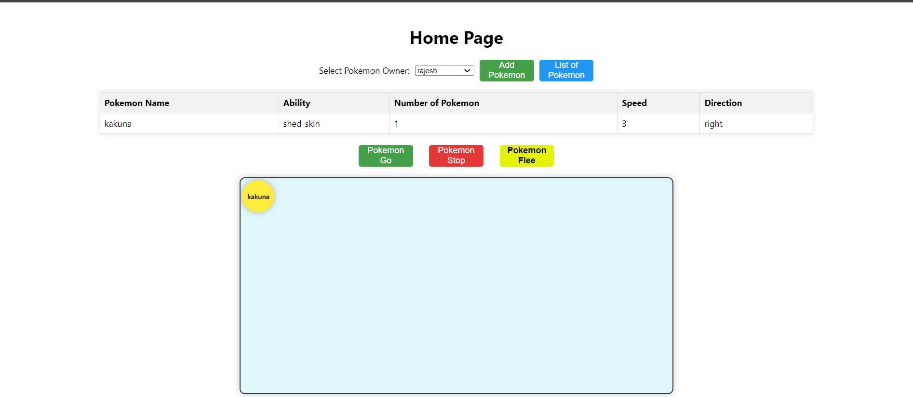

# Full-Stack Application

This project demonstrates a full-stack application with a frontend client and a backend server.

## Live Preview
- [Pokemon Full-Stack Application](https://client-five-rho-47.vercel.app) (first need to add pokemon)


This project is a fullstack application built with React that allows users to manage Pokemon data. The application includes functionality to add, edit, and delete Pokemon from a list, as well as perform specific actions on selected Pokemon. For state management, Redux is utilized, and notifications are handled using Tosts.

## Technologies Used

- **React**: A JavaScript library for building user interfaces.
- **Redux**: A predictable state container for JavaScript apps.(Reduce Api Calls)
- **Tosts**: A library for displaying notifications in React applications.
- **Not Use DB**: use node js state take array 

## Key Features

1. **State Management with Redux**:
   - Centralized state management for managing Pokemon data.
   - Actions and reducers to handle adding, editing, and deleting Pokemon.
   - Middleware for handling asynchronous actions.

2. **Notifications with Tosts**:
   - Display success, error, and information notifications for various actions.
   - Customizable notification appearance and behavior.

3. **Pokemon Management**:
   - **Add Pokemon**: A form to add new Pokemon to the list.
   - **Edit Pokemon**: Edit existing Pokemon details.
   - **Delete Pokemon**: Remove Pokemon from the list.
   - **Action Buttons**: Buttons to perform specific actions on Pokemon (e.g., Pokemon Go, Pokemon Flee, Pokemon Cease).

4. **User Interface**:
   - **Dropdowns**: Dropdown lists for selecting Pokemon and users.
   - **Responsive Design**: Ensuring the application is usable on various screen sizes using mediaquery CSS.

## Prerequisites

- [Node.js](https://nodejs.org/) (version 14.x or later)
- [npm](https://www.npmjs.com/get-npm)

## Project Structure

- **client/**: Contains the frontend application.
- **server/**: Contains the backend application.

## Setup

1. Clone the repository:

   ```sh
   git clone https://github.com/pothalarajesh282/pokemon-fullstack-application.git

2. Open an integrated terminal and install dependencies:
    ```sh
    cd client
    npm install
    cd server
    npm install

## Running the Application

1. run frontend
    ```sh
    cd client
    npm start

2. run the backend server
    ```sh
    cd server
    nodemon index.js
    # Or use: 
    node index.js
The backend server will be available at http://localhost:5000 (or your configured port).

## Code Changes

1. **Frontend**

   - Navigate to `src/utils/constants.js` and update the base URL for your backend:

     ```js
     // src/utils/constants.js
     const config = {
         baseUrl: "http://localhost:5000", // Change this to your backend URL
         }; 
     export default config;
     ```

## Video Tutorial

Here's a video tutorial on how to use the Pokémon Fullstack Application:

<video width="900" controls>
  <source src="./Recording 2024-08-07 145431.mp4" type="video/mp4">
  Your browser does not support the video tag.
</video>







## Note

<p style="color:red;">I am currently working on the client project, so I have not concentrated on CSS and have only focused on functionality.</p>


